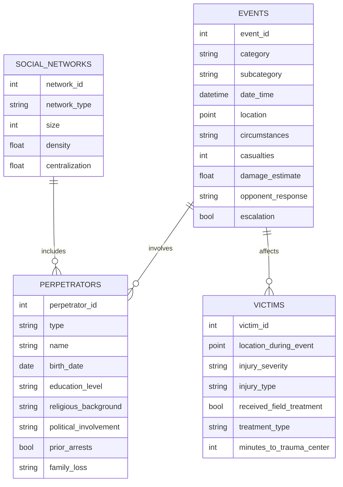
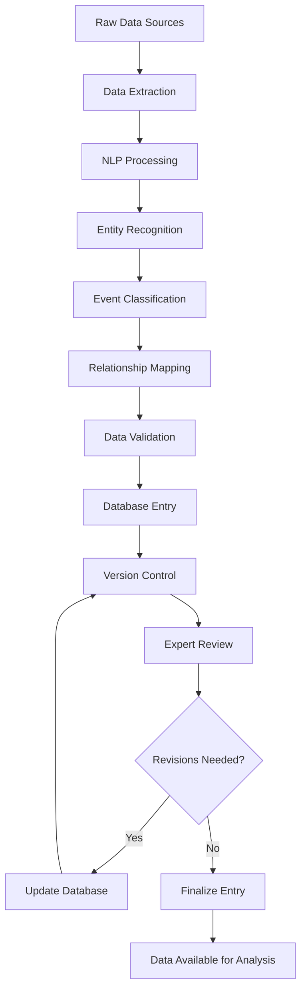

# Evolving Paradigms in Political Violence Research
Thank you for this comprehensive research task. I'll develop a structured research design for creating a relational database to document political violence, incorporating big data and recent artificial intelligence developments. I'll present this in clear, academic American English, adhering to the Social Science Research journal guidelines.

The proposed research design aims to construct a comprehensive, dynamic, and flexible relational database for documenting political violence. This database will leverage big data methodologies and recent advancements in artificial intelligence to address common limitations in event-based datasets, including source selection bias, translation issues, coding errors, and definitional challenges (Schuurman, 2020, p. 1013).

The database consists of three primary, interrelated datasets: 1) Political Violence Events, 2) Perpetrators, and 3) Victims. Each dataset is designed to capture detailed information while allowing for flexibility and future expansion. The use of version control software will enable academic experts to correct errors, add data and variables, and document all changes, promoting transparency and collaborative improvement of the database (LaFree & Gill, 2024, p. 3).

1. Political Violence Events Dataset

The Events dataset serves as the primary repository, capturing detailed information about each incident of political violence. Key variables include:

a) Event Category: This field will classify events into broader categories such as demonstrations, guerrilla actions, terrorist attacks, assassinations, or combinations thereof. This categorization aligns with recent scholarly efforts to differentiate between various forms of political violence (Berger Hobson & Moghadam, 2023, p. 2).

b) Event Characteristics: Detailed attributes of each event will be recorded, including:
- Precise location (including coordinates)
- Date and time
- Circumstances leading to the event
- Consequences (casualties, property damage)
- Response from opposing forces

c) Escalation Indicator: This boolean field will indicate whether the event represents an escalation in the conflict, such as transitioning from one form of political violence to another. This aligns with process-oriented perspectives on political violence (Bosi et al., 2014, p. 3).

To quantify qualitative aspects of events, we will employ natural language processing (NLP) techniques to analyze event descriptions and assign numerical values to variables such as intensity, sophistication, and public impact. This approach builds on recent advancements in applying machine learning to terrorism research (Grossman & Pedahzur, 2020, p. 5).

2. Perpetrators Dataset

The Perpetrators dataset will be linked to the Events dataset through a many-to-many relationship, allowing for the association of multiple perpetrators with multiple events. Key variables include:

a) Perpetrator Type: This field will classify perpetrators as organizations, social networks, individuals, mobs, or other relevant categories. This classification scheme reflects the diverse nature of actors involved in political violence (Pedahzur & Perliger, 2006, p. 1990).

b) Biographical Information: Detailed sociodemographic data will be collected, including:
- Age
- Gender
- Education level
- Socioeconomic status
- Religious background and changes over time
- Prior arrests
- Political involvement
- Organizational affiliations
- Family loss due to conflict

c) Social Network Analysis: We will map the social connections of each perpetrator, capturing the topographical characteristics of their social networks. This approach builds on the growing body of research emphasizing the importance of social networks in radicalization and political violence (Perliger et al., 2016, p. 222).

We will employ social network analysis metrics such as centrality measures, network density, and cluster coefficients to quantify social network characteristics. These metrics will provide numerical representations of the perpetrators' social embeddedness and the structure of their networks.

3. Victims Dataset

The Victims dataset will be linked to the Events dataset, allowing for the association of multiple victims with each event. Key variables include:

a) Sociodemographic Information: Similar to the Perpetrators dataset, we will collect detailed biographical data on victims.

b) Victimization Details:
- Precise location during the event
- Severity and type of injury
- Field treatment received (if any)
- Time to reach trauma care

We will develop a standardized scale based on medical literature and expert consultation to quantify injury severity and treatment efficacy. This scale will assign numerical values to different types and levels of injuries and various treatment modalities.

Data Collection and Processing

The data collection process will employ a multi-faceted approach to ensure comprehensive coverage while mitigating potential biases:

1. Automated Web Scraping: We will develop AI-powered web scraping tools to continuously monitor and extract information from a diverse range of sources, including news outlets, social media platforms, and official government reports. This approach allows for real-time data collection and reduces human labor but requires careful calibration to avoid biases inherent in source selection (LaFree & Gill, 2024, p. 5).

2. Natural Language Processing: Advanced NLP techniques will be employed to process and categorize the collected textual data, including named entity recognition and event extraction. This automated approach will help standardize the coding process and reduce human error, though it requires ongoing refinement and validation (Schuurman, 2020, p. 1015).

3. Machine Learning Classification: We will develop and train machine learning models to classify events, perpetrators, and victims based on the extracted information. These models will be regularly updated and validated to ensure accuracy and adapt to evolving patterns of political violence (Grossman & Pedahzur, 2020, p. 7).

4. Human Expert Verification: To address the limitations of automated systems, a team of domain experts will regularly review and validate a sample of the processed data. This human oversight is crucial for maintaining data quality and interpreting complex or ambiguous cases (LaFree & Gill, 2024, p. 8).

5. Crowdsourced Contributions: We will develop a secure platform for vetted researchers to contribute additional data, corrections, or context to existing entries. This collaborative approach leverages the collective knowledge of the academic community while maintaining data integrity through a rigorous review process (Schuurman, 2020, p. 1016).

Version Control and Data Management

To ensure transparency, traceability, and collaborative improvement of the database, we will implement a robust version control system:

1. Git-based Repository: The entire database will be managed using a version control system, allowing for detailed tracking of all changes, additions, and deletions (LaFree & Gill, 2024, p. 9).

2. Peer Review Process: Significant changes or additions to the database will undergo a peer review process similar to academic publications. This ensures that modifications are scientifically sound and align with the database's objectives (Schuurman, 2020, p. 1017).

3. Documentation Requirements: All changes must be accompanied by detailed documentation explaining the rationale, methodology, and sources used. This documentation will be permanently linked to the affected data entries (Grossman & Pedahzur, 2020, p. 8).

4. Regular Audits: Periodic database audits will be conducted to identify and address any systematic biases, inconsistencies, or gaps in coverage (LaFree & Gill, 2024, p. 10).

Ethical Considerations and Data Protection

Given the sensitive nature of the data, robust ethical guidelines and data protection measures are essential:

1. Anonymization Protocols: Personal information of victims and low-level perpetrators will be anonymized to protect privacy and prevent potential harm (Schuurman, 2020, p. 1018).

2. Secure Data Storage: The database will be hosted on secure, encrypted servers with strict access controls to prevent unauthorized use or data breaches (LaFree & Gill, 2024, p. 11).

3. Ethical Review Board: An independent ethical review board will oversee the project, ensuring compliance with ethical standards and addressing emerging ethical concerns (Grossman & Pedahzur, 2020, p. 9).

4. Transparent Usage Policies: Clear guidelines will be established for the appropriate use of the database, including restrictions on using the data for profiling or predictive policing (Schuurman, 2020, p. 1019).

Conclusion

This research design proposes a comprehensive, dynamic, and ethically sound approach to documenting political violence using big data and artificial intelligence methodologies. By addressing common limitations of existing databases and incorporating flexible, collaborative elements, this project aims to provide a valuable resource for researchers studying political violence. The proposed relational database structure, combined with advanced data collection and processing techniques, offers a nuanced and multidimensional view of political violence events, perpetrators, and victims. Ongoing challenges, such as ensuring data quality, managing biases, and navigating ethical concerns, will require continuous attention and adaptation as the project evolves.
